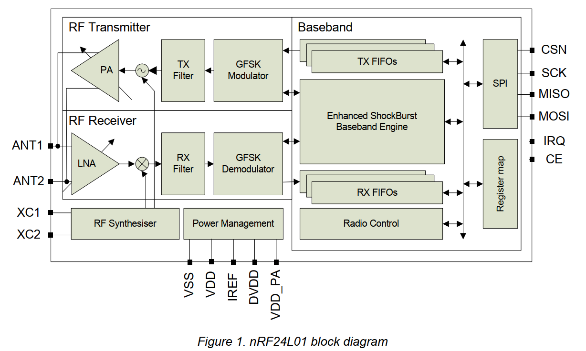

# 1. Introduction

### 简介

- nRF24l01是一个具有嵌入式基带引擎的2.4GHz单芯片收发器，专为超低功耗无线应用设计
- 2.4-2.4835GHz
- nRF24L01无线系统只需要一个MCU和很少外部元件

### 配置

- 使用SPI配置和操作
- 可以使用寄存器映射
- 寄存器映射包含nRF24l01中的所有配置寄存器，并且可以在芯片的所有操作模式下访问

### 基带协议

- [嵌入式基带协议引擎](./Appendix%20A%20-Enhanced%20ShockBurst.md)（Enhanced ShockBurst $^{\text{TM}}$）基于packet communicaition，支持从手动操作到高级资助协议操作的多种模式
- 内部的FIFOs确保了在无线电前端和系统MCU之间的平滑数据流
- Enhanced ShockBurst $^{\text{TM}}$通过处理所有告诉链路层操作来降低系统成本
  
### GFSK调制

- 无线电前端采用GFSK调制
- 它具有用户可配置的参数
  - 频道、输出功率和空中数据速率

### 速率和功耗

- nRF24L01支持的空中数据速率可配置为2Mbps
- 高 空中速率与两种省电模式相结合，使nRF24L01非常适合超低功耗设计

### 稳压

- 内部电源控制确保高电源抑制比（PSRR）和宽电源范围

## 1.1 特性

nRF24L01的特性包括：

- 无线电
  - 全球2.4GHz ISM频段运行
  - 126RF 频道
  - 常见的RX TX引脚
  - GFSK调制
  - 1 & 2 Mbps
  - 1Mbps 时 1MHz 非重叠信道间隔
  - 2Mbps 时 2MHz 非重叠信道间隔
- 发射机
  - 可编程输出功率：0、-6、-12 或 -18dBm
  - 0dBm 输出功率时为 11.3mA
- 接收机
  - 集成通道滤波器
  - 2Mbps 时为 12.3mA
  - -82dBm 灵敏度 at 2Mbps
  - -85dBm 灵敏度 at 1Mbps
  - 可编程 LNA 增益
- 射频合成器
  - 完全集成的合成器
  - 无需外部环路滤波器、VCO 变容二极管或谐振器
  - 16Mhz 晶振 low cost $\pm$ 60ppm
- Enhanced ShockBurst™
- Power Management
- Host Interface
- Compact 20-pin 4x4mm QFN package

## 1.2 块状图

