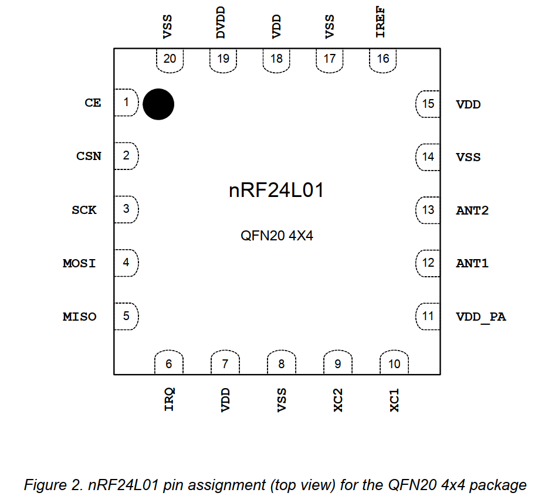

# 2. 管脚

## 2.1 引脚分配

## 2.2 引脚功能

|Pin|Name|Pin function|Description|
|---|----|------------|-----------|
|1  |CE  |数字输入    |芯片启用激活RX或TX模式|
|2  |CSN |数字输入    |SPI片选 非|
|3  |SCK |数字输入    |SPI 时钟|
|4  |MOSI|数字输入    |SPI从机数据输入|
|5  |MISO|数字输出    |SPI从机数据输出，具有三态选择
|6  |IRQ |数字输出    |可屏蔽终端引脚，低电平有效|
|7  |VDD |电源       |电源（+1.9v - + 3.6v DC）|
|8  |VSS |电源       |地（0 V）|
|9  |XC2 |模拟输出    |Crystal Pin 2|
|10 |XC1 |模拟输入    |Crystal Pin1 |
|11 |VDD_PA|电源输出  |内部nRF24L01功率放大器的电源输出（+1.8V）,必须连接到**ANT1**和**ANT2**,[如图30](./Appendix%20D%20-%20Application%20example#示例电路图)所示
|12 |ANT1|RF         |天线接口1|
|13 |ANT2|RF         |天线接口2|
|14 |VSS |电源       |地（0 V）|
|15 |VDD |电源       |电源（+1.9v - + 3.6v DC）|
|16 |IREF|模拟输入    |参考电流，将22K$\varOmega$接地，[如图30](./Appendix%20D%20-%20Application%20example#示例电路图)所示
|17 |VSS |电源       |地（0 V）|
|18 |VDD |电源       |电源（+1.9v - + 3.6v DC）|
|19 |DVDD|电源输出   |电源（+1.9v - + 3.6v DC）|用于去耦目的的内部数字电源输出|
|20 |VSS |电源       |地（0 V）|
