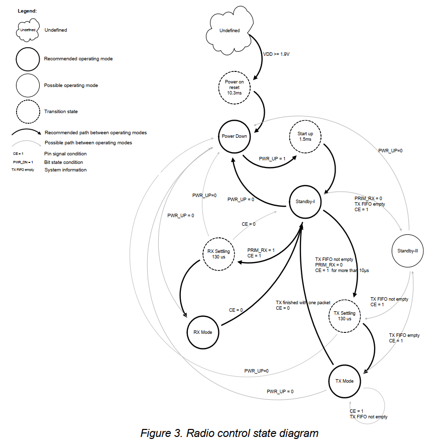

# 6. 无线电控制

本章介绍nRF24L01无线电接收器可以运行的不同模式以及用于控制无线的参数

nRF24L01 有一个内置状态机，用于控制芯片不同工作模式之间的转换。 状态机从用户定义的寄存器值和内部信号获取输入。

## 6.1 运行模式

nRF24L01 可配置为四种主要操作模式。 本节描述这些模式

### 6.1.1 状态图

状态图显示了nRF24L01可以运行的模式，以及如何访问他们。

nRF24L01在VDD变为1.9V或更高之前没有定义

当这种情况发生时，nRF24L01进入商店复位状态，并保持复位状态，直到进入[掉电模式](#612-掉电模式)

即使当nRF24L01进入掉电模式时，MCU也可以通过SPI和芯片使能（**CE**）引脚控制芯片。状态途中使用了三种类型的状态。

“推荐操作模式”是正常操作期间使用的状态

“可能的操作模式”是允许使用的状态，但在正常操作期间不使用

“过渡状态”是振荡器启动和PLL稳定期间使用的时间限制状态

### 6.1.2 掉电模式

在掉电模式下，nRF24L01被禁用，电流消耗最小。

在掉电模式下，SPI可用的所有寄存器值都会被保留，并且SPI可以被激活

有关启动的时间，请参照[表13](#表13)

### 6.1.3 待机模式

通过将 `CONFIG` 寄存器中的 `PWR_UP 位设置为 1，器件进入待机 I 模式。

待机 I 模式用于最大限度地减少平均电流消耗，同时保持较短的启动时间。

在此模式下，部分晶体振荡器处于活动状态。

这是当 **CE** 设置为低电平时 nRF24L01 从 TX 或 RX 模式返回的模式

在待机 II 模式下，与待机 I 模式相比，额外的时钟缓冲器处于活动状态，并且与待机 I 模式相比，使用更多的电流。

当 **CE** 在具有空 TX FIFO 的 PTX 设备上保持高电平时，会发生待机 II。

如果新数据包上传到 TX FIFO，则 PLL 启动并传输数据包。

寄存器值在待机模式期间保持不变，并且 SPI 可以被激活。 有关启动时间，请参阅[表13](#表13)

### 6.1.4 接收模式（RX mode）

当nRF24L01是接收者的时候，RX模式是激活的。

要进入此模式，nRF24L01 必须将 `PWR_UP` 位设置为高电平，将 `PRIM_RX` 位设置为高电平，并将 **CE** 引脚设置为高电平。

在此模式下，接收器解调来自 RF 通道的信号，不断将解调数据提供给基带协议引擎。 基带协议引擎不断搜索有效的数据包。

如果找到有效数据包（通过匹配地址和有效 CRC），则数据包的有效负载将出现在 RX FIFO 的空槽中。

如果 RX FIFO 已满，则丢弃接收到的数据包。

nRF24L01 保持在 RX 模式，直到 MCU 将其配置为待机 I 模式或掉电模式。

如果基带协议引擎中的自动协议功能（Enhanced ShockBurst™）启用，nRF24L01 可以进入其他模式以执行协议。

在 RX 模式下，载波检测信号可用。

载波检测是当在接收频道内检测到 RF 信号时设置为高的信号。

为了安全检测，信号必须经过 FSK 调制。

还可以检测到其他信号。

- 当在 RX 模式下检测到 RF 信号时，载波检测 (CD) 设置为高电平，否则 CD 为低电平。

- 内部 CD 信号在提供给 CD 寄存器之前经过过滤。

- 在 CD 设置为高电平之前，RF 信号必须存在至少 128μs。
- [附录 E](./Appendix%20E%20-%20stationary%20disturbance%20detection.md) 介绍了如何使用 CD。

### 6.1.5 发送模式(TX mode)

nRF24L01 发送数据包时，TX模式激活

要进入此模式，nRF24L01 必须将 `PWR_UP` 位设置为高，将 `PRIM_RX` 位设置为低，将有效负载置于 TX FIFO 中，并且在 **CE** 上设置一个持续超过 10μs 的高脉冲。

nRF24L01 保持在 TX 模式，直到完成当前数据包的传输。

- 如果 CE = 0，nRF24L01 返回待机 I 模式。
- 如果 CE = 1，则下一步操作由 TX FIFO 的状态决定。
  - 如果 TX FIFO 不为空，则 nRF24L01 保持在 TX 模式，传输下一个数据包。
  - 如果 TX FIFO 为空，则 nRF24L01 进入待机 II 模式。

nRF24L01 发送器 PLL 在 TX 模式下以开环方式运行。

切勿让 nRF24L01 处于 TX 模式的时间一次超过 4ms，这一点很重要。

如果启用自动重传，则 nRF24L01 处于 TX 模式的时间永远不会长到足以违反此规则。

### 6.1.6 操作模式配置

表12描述了如何配置操作模式

#### 表12
|模式|PWR_UP|PRIM_RX|CE|FIFO 状态|
|---|------|--------|--|--------|
|RX 模式|1 |1 |1 |- |
|RX 模式|1 |0 |1 |数据在TX FIFO 将清空TX FIFO$^a$中的所有级别|
|RX 模式|1 |0 |最小10$\mu$s的高电平 |数据在TX FIFO 将清空TX FIFO$^b$中的所有级别|
|待机-II 模式|1 |0 |1 |TX FIFO 空|
|待机-I 模式|1 |- |0 |没有正在进行数据包传输|
|掉电|0|-|-|-|

### 6.1.7 定时信息

本节中的时序信息与模式之间的转换和**CE**引脚的时序相关

从TX模式到RX模式的转换（反之亦然）与从standby-I到TX模式或RX模式的转换相同

#### 表13

|名字|nRF24L01|最大值|最小值|注释|
|---|--------|------|-----|----|
|Tpd2stby|power Down $\rightarrow$ Standby mode|1.5ms||内部晶振|
|Tpd2stby|power Down $\rightarrow$ Standby mode|150$\mu$s||带外部时钟|
|Tstby2a|Standby modes $\rightarrow$TX/RX mode|130$\mu$s|||
|Thce|最小**CE**高电平||10$\mu$s||
|Thece2csn|从**CE**边缘到**CSN**低电平的延迟||4$\mu$s||
