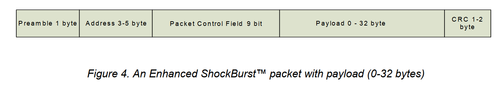
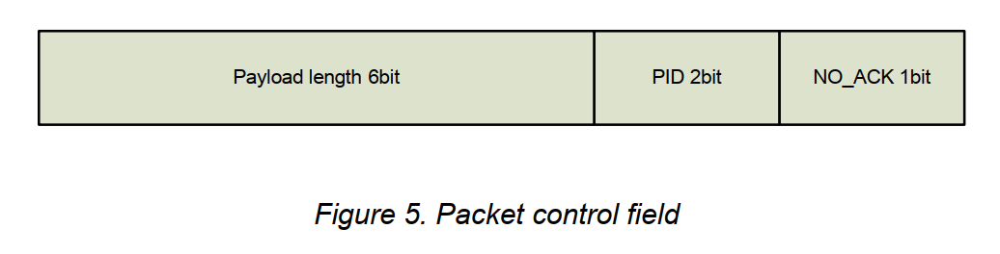
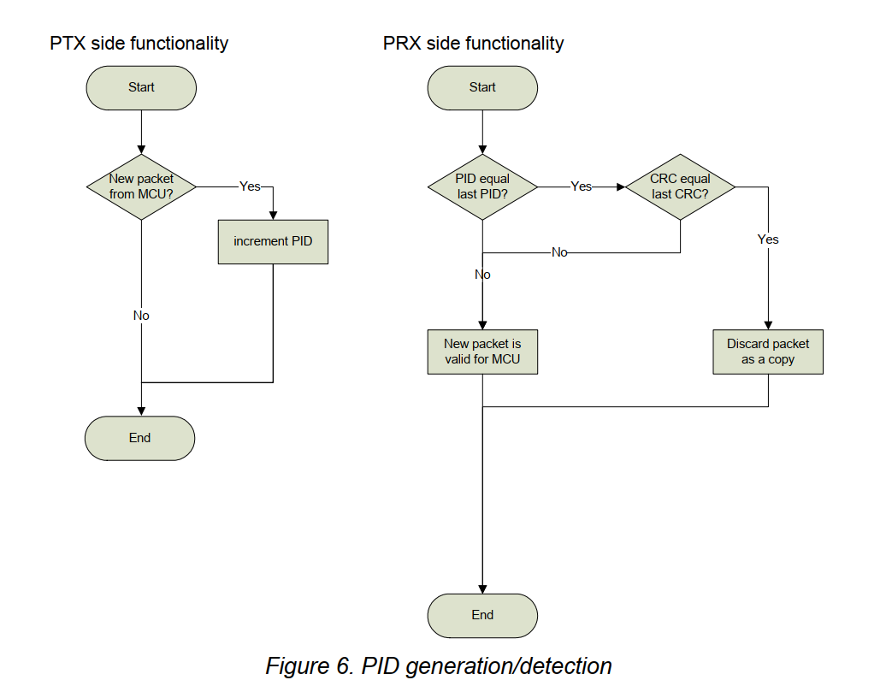
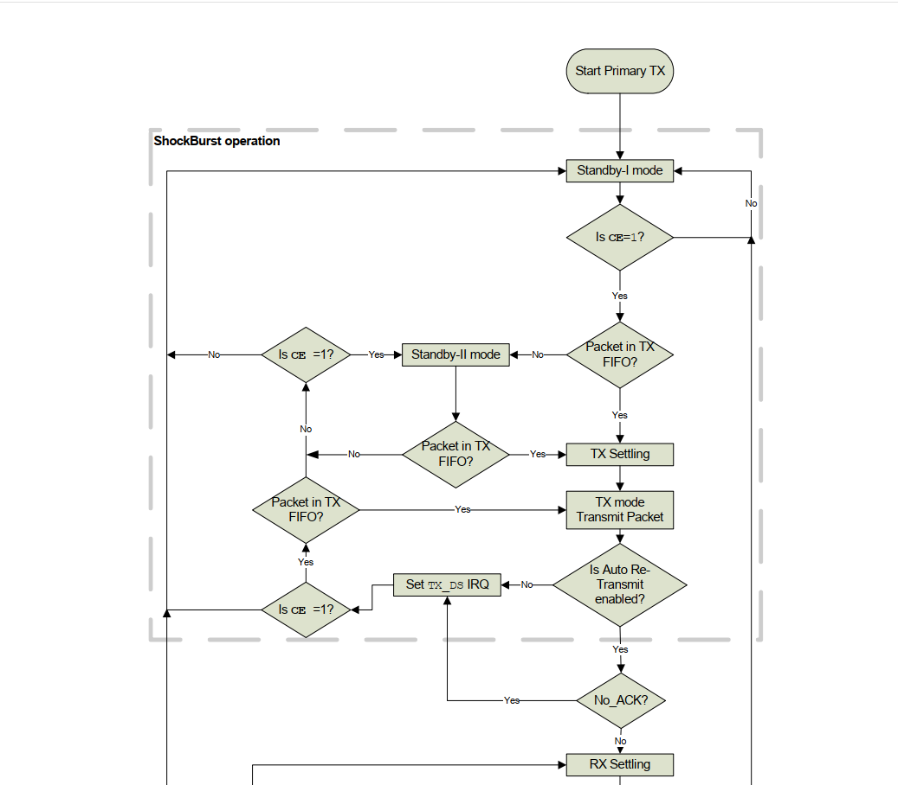
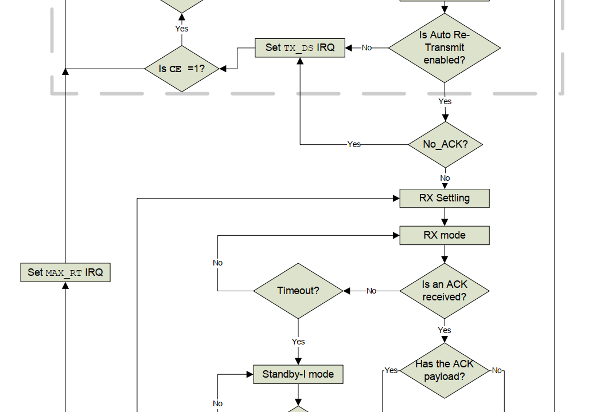
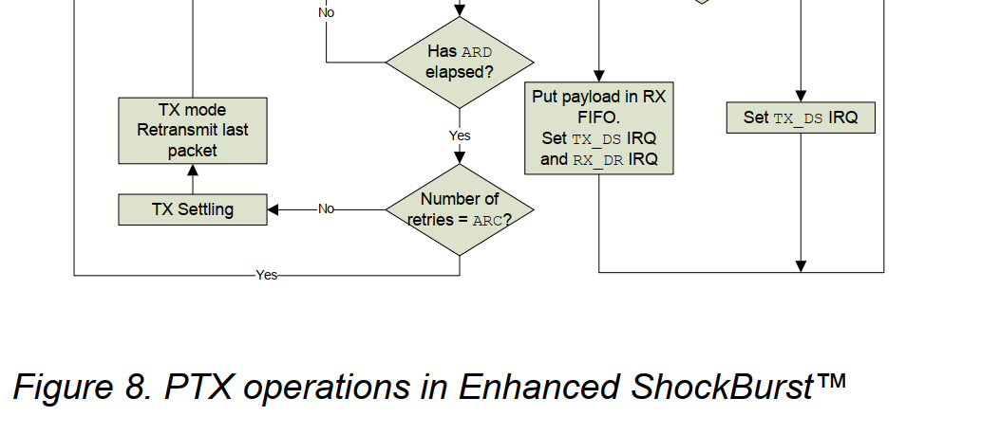

# 7 Enhanced ShockBurst

增强型 ShockBurst™ 是基于数据包的数据链路层。

它具有自动数据包组装和计时、自动确认和重新传输数据包的功能。

增强型 ShockBurst™ 可实现与低成本主机微控制器的超低功耗、高性能通信。

这些功能可显着提高双向和单向系统的电源效率，而不会增加主机控制器端的复杂性。

## 7.1 特性

增强型 ShockBurst™ 的主要特点是：

- 1 至 32 字节动态负载长度
- 自动数据包处理
- 自动数据包事务处理
  - 自动确认
  - 自动重传
- 用于 1:6 星形网络的 6 个数据管道 MultiCeiver™

## 7.2 增强型 ShockBurst™ 概述

增强型 ShockBurst™ 使用 ShockBurst™ 进行自动数据包处理和计时。

在传输过程中，ShockBurst™ 组装数据包并将数据包中的位计时到发送器中进行传输。

在接收过程中，ShockBurst™ 不断在解调信号中搜索有效地址。

- 当 ShockBurst™ 找到有效地址时，它会处理数据包的其余部分并通过 CRC 对其进行验证。
- 如果数据包有效，则有效负载将移至 RX FIFO 中。
- 高速位处理和定时由 ShockBurst™ 控制

增强型 ShockBurst™ 具有自动数据包事务处理功能，可实现可靠的双向数据链路。

增强型 ShockBurst™ 数据包事务是收发器之间的数据包交换，其中一个收发器是主接收器 (PRX)，另一个是主发送器 (PTX)。

增强型 ShockBurst™ 数据包事务始​​终由 PTX 的数据包传输发起，当 PTX 收到来自 PRX 的确认数据包（ACK 数据包）时事务完成。

自动数据包事务处理的工作原理如下：

- 用户通过将数据包从PTX发送到PRX来发起交易。 增强型 ShockBurst™ 自动将 PTX 设置为接收模式以等待 ack 数据包。
- 如果 PRX 收到数据包，Enhanced ShockBurst™ 会在返回接收模式之前自动组装并向 PTX 发送确认数据包（ACK 数据包）
- 如果 PTX 在设定时间内没有收到 ACK 数据包，Enhanced ShockBurst™ 将自动重传原始数据包，并将 PTX 设置为接收模式以等待 ACK 数据包

PRX 可以将用户数据附加到 ACK 数据包上，从而实现双向数据链路。增强型 ShockBurst™ 具有高度可配置性； 可以配置参数，例如最大重传次数以及从一次传输到下一次重传的延迟。 所有自动处理都是在没有 MCU 参与的情况下完成的。

[7.3 节](#73-增强型-shockburst-数据包格式)介绍了增强型 ShockBurst 数据包格式；

[7.4 节](#74-自动数据包处理)介绍了自动数据包处理；

[7.5 节](#75-自动数据包拆包处理)介绍了自动数据包事务处理；

[7.6 节](#76-增强型-shockburst-流程图)提供了 PTX 和 PRX 操作的流程图

## 7.3 增强型 ShockBurst 数据包格式

本章介绍了增强型 ShockBurst™ 数据包的格式。

增强型 ShockBurst™ 数据包包含前导码字段、地址字段、数据包控制字段、有效负载字段和 CRC 字段。

图 4 显示了 MSB 位于左侧的数据包格式。

### 7.3.1 前导码字段

一个字节，`01010101`或`10101010`,根据地址第一位确定，目的是确保前导码有足够的转换来稳定接收器

### 7.3.2 地址

接收器的地址。确保正确的数据包背接收机所检测。

地址字段可通过 AW 寄存器配置为 3、4 或 5 个字节长。

注意：电平仅移动一次的地址会被检测为噪声，如（000FFFFFFF）

### 7.3.3 数据包控制字段

图5显示了9位数据包控制字段的格式，MSB在左边

数据包控制字段包含 6 位有效负载长度字段、2 位 PID（数据包标识）字段和 1 位 `NO_ACK`标志

#### 7.3.3.1 有效负载长度

这个 6 位字段指定有效负载的长度（以字节为单位）。

有效负载的长度可以是 0 到 32 字节。

编码：000000 = 0 字节（仅用于空 ACK 数据包。）100000 = 32 字节，100001 = 无关。

仅当启用动态负载长度功能时才使用该字段。

#### 7.3.3.2 PID（数据包识别）

2 位 PID 字段用于检测接收到的数据包是新的还是重传的。

PID 可防止 PRX 设备向 MCU 多次呈现相同的有效负载。

对于通过 SPI 接收到的每个新数据包，PID 字段在 TX 侧递增。

PRX 设备使用 PID 和 CRC 字段（请参阅第 26 页上的 7.3.5 节）来确定数据包是重传的还是新的。

当链路上丢失多个数据包时，PID 字段可能会等于最后接收到的 PID。 如果数据包与前一个数据包具有相同的 PID，则 nRF24L01 会比较两个数据包的 CRC 和。

如果 CRC 和也相等，则最后接收到的数据包将被视为先前接收到的数据包的副本并被丢弃。

#### 7.3.3.3 无确认标志(`NO_ACK`)

选择性自动确认功能控制 NO_ACK 标志。

该标志仅在使用自动确认功能时使用。

将标志设置为高电平，告诉接收者该数据包不会被自动确认。

### 7.3.4 有效负载

有效负载是用户定义的数据包内容。

它的宽度可以是 0 到 32 字节，并在上传（未修改）到设备时进行空中传输。

### 7.3.5CRC（循环冗余校验）

CRC 是数据包中的错误检测机制。

它可以是 1 或 2 个字节，并根据地址、数据包控制字段和有效负载进行计算。

1 字节 CRC 的多项式为 $X^8+X^2+X+1$。初始值 0xFF

2 字节 CRC 的多项式为 $X^{16}+X^{12}+X^5+1$。初始值 0xFFFF

## 7.4 自动数据包处理

增强型 ShockBurst™ 使用 ShockBurst™ 进行自动数据包处理。 

功能有:

- 静态和动态有效负载长度
- 自动数据包组装
- 自动数据包验证
- 自动数据包分解

### 7.4.1 静态和动态有效负载长度

增强型 ShockBurst™ 提供了两种处理有效负载长度的替代方案：静态和动态。

默认替代方案是静态有效负载长度。 对于静态有效负载长度，发送器和接收器之间的所有数据包都具有相同的长度。静态负载长度由接收器侧的`RX_PW_Px`寄存器设置。发送器端的有效负载长度由时钟输入`TX_FIFO`的字节数设置，并且必须等于接收器端`RX_PW_Px`寄存器中的值

动态有效负载长度（DPL）是静态有效负载长度的替代方案。DPL 使发送器能够向接收器发送具有可变有效负载长度的数据包。这意味着对于具有不同有效负载长度的系统，无需将数据包长度调整为最长有效负载。

借助 DPL 功能，nRF24L01 可以自动解码接收到的数据包的有效负载长度，而无需使用 `RX_PW_Px`寄存器。  MCU 可以使用`R_RX_PL_WID`命令读取接收到的有效负载的长度。

为了启用 DPL，必须设置`FEATURE`寄存器中的`EN_DPL`位。 

在 RX 模式下，必须设置 `DYNPD`寄存器。 发送到启用 DPL 的 PRX 的 PTX 必须设置`DYNPD`中的`DPL_P0`位。

### 7.4.2 自动包组装

自动数据包组装将前导码、地址、数据包控制字段、有效负载和 CRC 组装成一个完整的数据包，然后再进行传输。

### 7.4.3 自动数据包验证

增强型 ShockBurst™ 具有自动数据包验证功能。 在接收模式下，nRF24L01 不断搜索有效地址（在 RX_ADDR 寄存器中给出）。如果检测到有效地址，Enhanched ShockBurst™ 将开始验证数据包。

对于静态数据包长度，Enhanced ShockBurst™ 将根据 RX_PW 寄存器给定的长度捕获数据包。 使用 DPL 增强型 ShockBurst™ 根据数据包控制字段中的有效负载长度字段捕获数据包。 捕获数据包后，Enhanced ShockBurst™ 将执行 CRC。

如果 CRC 有效，Enhanced ShockBurst™ 将检查 PID。 将接收到的 PID 与之前接收到的 PID 进行比较。 如果 PID 字段不同，则认为该数据包是新的。 如果 PID 字段相等，接收器必须检查接收到的 CRC 是否等于先前的 CRC。 如果 CRC 相等，则该数据包被定义为与前一个数据包相同并被丢弃。 请参阅图 6 中的流程图

### 7.4.4 自动拆包

数据包经过验证后，Enhanced ShockBurst™ 会分解数据包并将有效负载加载到`RX FIFO`中，并置位`RX_DR IRQ`

## 7.5 自动数据包拆包处理

增强型 ShockBurst™ 具有两种自动数据包事务处理功能； 自动确认和自动重传。

### 7.5.1 自动确认

自动确认是一种在 PTX 接收并验证数据包后自动向 PTX 发送 ACK 数据包的功能。 自动确认功能可减轻系统 MCU 的负载，并且无需专用 SPI 硬件。 这也降低了成本和平均电流消耗。 通过设置`EN_AA`寄存器来启用自动确认功能

注意：如果接收到的数据包设置了`NO_ACK`标志，则不执行自动确认。

ACK 数据包可以包含从 PRX 到 PTX 的可选有效负载。 为了使用此功能，必须启用动态有效负载长度功能。  PRX 侧的 MCU 必须使用`W_ACK_PAYLOAD`命令将有效负载计时到`TX FIFO`中，从而上传有效负载。 有效负载在`TX FIFO (PRX)`中等待，直到从 PTX 接收到新数据包为止。  

nRF24L01 可以同时在`TX FIFO (PRX)`中保留三个待处理的 ACK 数据包有效负载

图 7 显示了处理待处理 ACK 数据包有效负载时`TX FIFO (PRX)`的工作方式。 从 MCU 中，通过`W_ACK_PAYLOAD`命令记录有效负载。

地址解码器和缓冲区控制器确保有效负载存储在`TX FIFO (PRX)`的空闲槽中。 当接收到数据包时，地址解码器和缓冲区控制器会收到 PTX 地址通知。

这确保了向 ACK 生成器提供正确的有效负载

如果`TX FIFO (PRX)`包含多个 PTX 有效负载，则将使用先进先出原则处理有效负载。 

如果所有挂起的有效负载都被寻址到链路丢失的 PTX，则`TX FIFO (PRX)`将被阻止。 在这种情况下，MCU 可以使用`FLUSH_TX`命令刷新 `TX FIFO (PRX)`。

为了启用有效负载自动确认，必须设置 `FEATURE` 寄存器中的 `EN_ACK_PAY` 位

### 7.5.2 自动重传（ART）

## 7.6 增强型 ShockBurst 流程图

