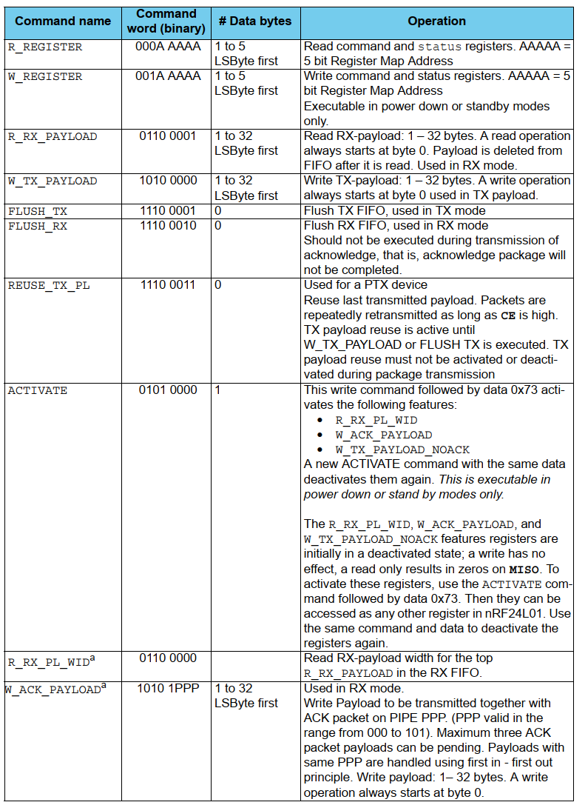
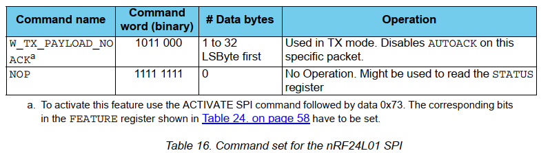
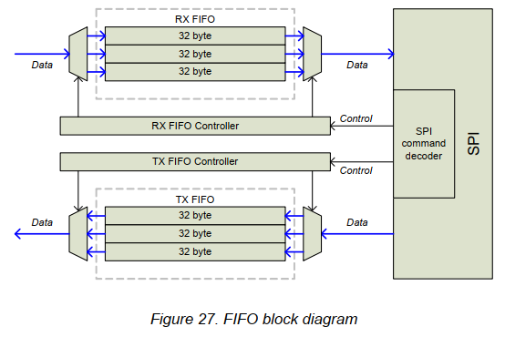

# 数据和控制接口

数据和控制接口使您可以访问 nRF24L01 中的所有功能。 数据和控制接口由以下六个 5V 耐受数字信号组成：

- IRQ（该信号为低电平有效，由三个可屏蔽中断源控制）
- CE（该信号为高电平有效，用于在 RX 或 TX 模式下激活芯片）
- CSN（SPI 信号）
- SCK（SPI 信号）
- MOSI（SPI 信号）
- MISO（SPI 信号）

在所有操作模式下，您都可以使用 SPI 通过 1 字节 SPI 命令来激活 nRF24L01 数据 FIFO 或寄存器映射。

## 8.1 特性

- 用于快速访问最常用功能的特殊 SPI 命令
- 0-8Mbps 4 线 SPI 串行接口
- 8 位命令集
- 易于配置的寄存器映射
- 用于 TX 和 RX 方向的完整三级 FIFO

## 8.2 功能说明

SPI 是标准 SPI，最大数据速率为 8Mbps。

## 8.3 SPI 操作

本章介绍 SPI 命令和 SPI 时序

### 8.3.1 SPI 命令

SPI 命令如表 16 所示。每个新命令都必须通过 CSN 上的高电平到低电平的转换来启动。

与应用于 MOSI 引脚上的 SPI 命令字并行，`STATUS` 寄存器在 MISO 引脚上串行移出。

串行移位 SPI 命令的格式如下：

<命令字：MSBit 至 LSBit（一个字节）>

<数据字节：LSByte 到 MSByte，每个字节首先是 MSBit>

### 8.3.2 SPI 时序

## 8.4 Data FIFO

数据 FIFO 用于存储发送的有效负载 (TX FIFO) 或接收并准备输出的有效负载 (RX FIFO)。  FIFO 在 PTX 模式和 PRX 模式下均可访问。

nRF24L01 中存在以下 FIFO：

- TX 三级，32 字节 FIFO
- RX 三级，32 字节 FIFO

两个 FIFO 都有一个控制器，并且可以使用专用 SPI 命令通过 SPI 进行访问。

PRX 中的 TX FIFO 可以将 ACK 数据包的有效负载存储到三个不同的 PTX 设备。

如果 TX FIFO 包含多个到管道的有效负载，则使用先进先出原则处理有效负载。

如果所有挂起的有效负载都被寻址到与 PTX 的链路丢失的管道，则 PRX 中的 TX FIFO 将被阻塞。 在这种情况下，MCU 可以使用 `FLUSH_TX` 命令刷新 TX FIFO。

PRX 中的 RX FIFO 可能包含来自最多三个不同 PTX 设备的有效负载

PTX 中的 TX FIFO 最多可以存储三个有效负载

TX FIFO 可以通过三个命令写入：

- PTX 模式下的 `W_TX_PAYLOAD`
- 和 `W_TX_PAYLOAD_NO_ACK`
- 以及 PRX 模式下的 `W_ACK_PAYLOAD`。

所有三个命令都可以访问 TX_PLD 寄存器。

在 PTX 和 PRX 模式下，可以通过命令 `R_RX_PAYLOAD` 读取 RX FIFO。

该命令提供对 RX_PLD 寄存器的访问。

如果 `MAX_RT` IRQ 置位，则不会删除 PTX 中 TX FIFO 中的有效负载。

图 27 是 TX FIFO 和 RX FIFO 的框图。

在 `FIFO_STATUS` 寄存器中，可以读取 TX 和 RX FIFO 是满还是空。  

`TX_REUSE` 位也可在 `FIFO_STATUS` 寄存器中使用。  

`TX_REUSE 由` SPI 命令 `REUSE_TX_PL` 设置，并由 SPI 命令 `W_TX_PAYLOAD` 或 `FLUSH TX` 复位。

## 8.5 中断

nRF24L01 有一个低电平有效中断 (IRQ) 引脚。

当 `STATUS` 寄存器中的状态机将 `TX_DS` IRQ、`RX_DR` IRQ 或 `MAX_RT` IRQ 设置为高电平时，IRQ 引脚被激活。

当 MCU 将“1”写入 `STATUS` 寄存器中的 IRQ 源位时，IRQ 引脚复位。  

`CONFIG` 寄存器中的 IRQ 掩码用于选择允许断言 IRQ 引脚的 IRQ 源。 通过将 `MASK` 位之一设置为高，相应的 IRQ 源被禁用。 默认情况下，所有 IRQ 源均已启用。
